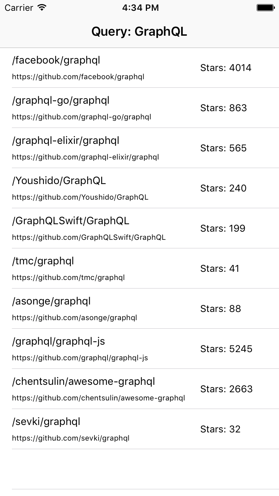

# GitHub-GraphQL-API-Example-iOS

A simple iOS example app of GitHub GraphQL API using [Apollo iOS](https://github.com/apollographql/apollo-ios).

* Article (deprecated)
  * https://www.shingt.com/blog/2017/04/02/graphql-on-ios-using-apollo

## Requirements

- Xcode 11.5
- Swift 5.2

## How to start

- Open `GitHub-GraphQL-API-Example-iOS.xcodeproj`
- Replace `YOUR_TOKEN` in `RepositoriesViewController` with your private access token on GitHub and build!

